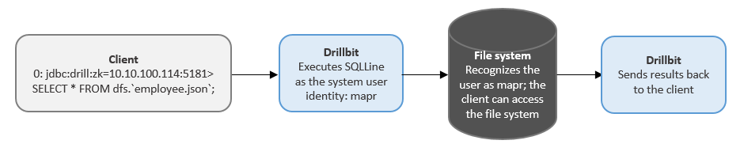
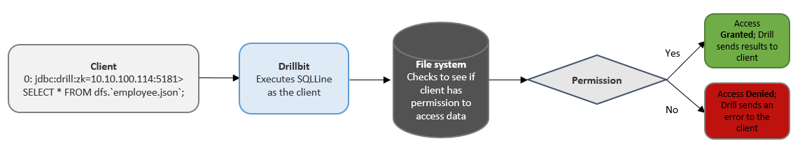

# 配置模拟身份

模拟允许服务的行为，执行客户端所请求的动作。默认情况下，模拟身份在 Drill 上是禁止的。你可以配置模拟身份在 ``` /conf/drill-override.conf ``` 文件下。

当你启用模拟身份，Drill 会执行客户端请求，让用户登录到客户端。Drill 将用户凭证传递给文件系统，然后文件系统会检查该用户是否有权限访问数据。当你启用认证，Drill 用可插拔认证模块（PAM）来验证用户的身份之前，用户可以访问 Drillbit。详情见用户验证。

如果模拟身份没有配置，Drill 执行所有客户端请求，在文件系统为用户服务的节点上启动 Drillbit 服务。这是一个典型的特权用户。该文件系统验证该系统用户具有访问数据的权限。

## 例子

当模拟身份被禁用，然后用户通过 SQLLine 客户端发送一个查询请求，SQLLine 会通过查询去连接 Drillbit。Drillbit 执行查询的系统用户，会在节点上开始处理。例如，我们假设系统用户已经完全访问文件系统。Drill 执行该查询并将结果返回给客户端。



当模拟身份被启用，用户通过 SQLLine 客户端发送一个请求，Drillbit 会先验证该用户访问文件系统中数据的权限。如果有，Drill 将查询结果返回给客户端。如果该用户没有权限，Drill 返回一个错误。



## 模拟身份支持

下表列出了客户端，存储插件，查询类型，可以在 Drill 中使用模拟身份：

+---------+--------------------------+----------------------+
| 类型     | 支持                     |  不支持               |
+---------+--------------------------+----------------------+
| 客户端   | SQLLine，ODBC，JDBC       | Web 控制台，REAT API  |
+---------+--------------------------+----------------------+
| 存储插件 | 文件系统                   | Hive，HBase          |
+---------+--------------------------+----------------------+ 
